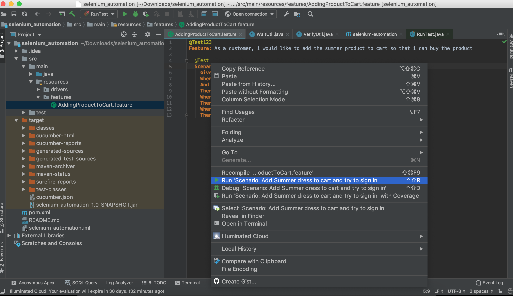
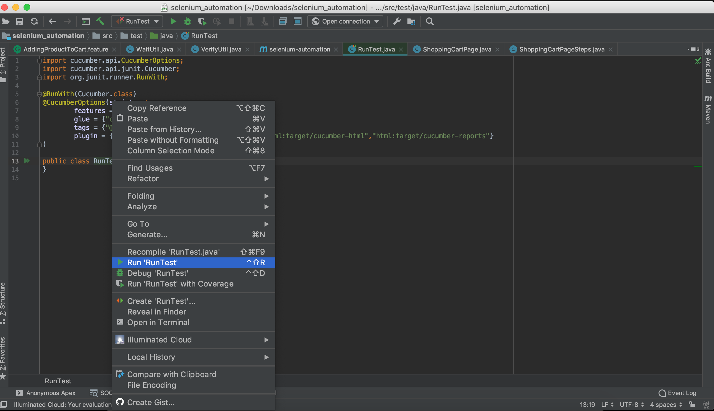

# Prerequisite

(1) Install JAVA JDK 
   - Download  http://www.oracle.com/technetwork/java/javase/downloads/jdk8-downloads-2133151.html
Download 'Java JDK1.8 setup' from oracle site based on your operating system (32 bit/64 bit).

- Set JAVA_HOME path

(2) Install Maven 
   - Download Maven http://maven.apache.org/download.cgi
   - Set M2_HOME and MAVEN_HOME
   
(3) Install IDE any of your choice Either IntelliJ IDEA Community Version Or Eclipse

(4) Install Cucumber plugin for IDE

(5) Install Gherkin plugin for IDE

# Run Tests

(1) Executing test case from feature file – Right click on the Feature file test case/scenario and select Run option
 
 
 
(2) Executing test case from Runner class
   - Open the Run.java file in IDE from Project explorer. Right click on the file and click on option ‘Run’.
   - ‘tags’ field here will search for the tags mentioned in the feature files.
    ‘format’ field mentions the output file formats to be created post completion of test case execution.
    
 
    
(3) Executing test cases using Maven command:
  
  a) To use maven commands without parameters, user can simply run below commands on IDE terminal-
        
    mvn clean verify
    or
    mvn clean install
    
  b) Using Maven command with parameters: Open Terminal window on the IDE (ex: IntelliJ) and type one of the below maven commands as per requirement:
    
    mvn clean verify -Dtags=@Test -Dtest.run.env=qaEnv -Dtest.run.type=local -Dtest.run.browser=chrome -Dtest.run.browser.version=80 
  
  
# Description

(1) Project setup with Maven

(2) Makes use of Page Object Model

(3) Test case written in Feature file using Cucumber-Gherkin Syntax

(4) Page Objects are in `./Pages` folder

(5) Step Definitions are in `./stepDefs` folder

(6) Runner class in `./test/java` folder

(7) Cucumber HTML report are getting generated on `./target/cucumber-html` folder

(8) By default the test will run in `Chrome Browser` with version `80`. You can give browser and version in  `./Appconfig.java` file

(9) `./resources/drivers` folder contain the Chromedriver, If you want to run against Firefox add GeckoDriver in this folder

